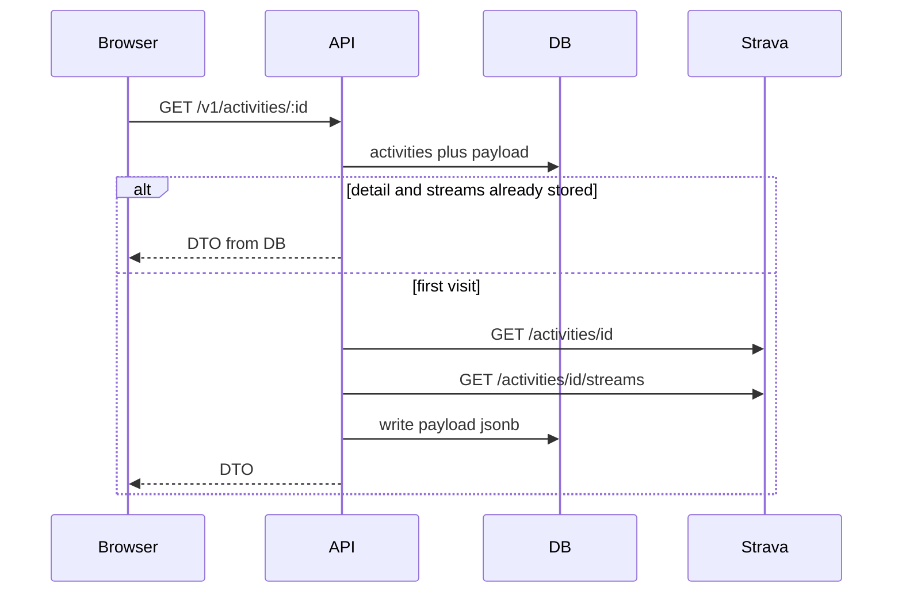

# Activity fields and a details page (no implementation)

## Decision: hydrate when the user opens the page, then never again

This matches what you described.

- **List / connect / resync last month:** `GET /athlete/activities` only. Cheap. No per-activity detail calls.
- **First visit to `/app/activities/:id`:** Fastify calls Strava for that one activity (`GET /activities/{id}` + streams), writes `{ activity, streams }` into `activity_sources.payload` jsonb, returns a RoadTo DTO.
- **Every later visit to the same activity:** read Postgres only. **Zero** Strava requests, so no rate-limit use.

Activities the user never opens are never hydrated. That is the point of not fetching everything at import.

You still spend **2 Strava requests on the first open** of each activity. You do not spend them for the rest of the library.

Optional later: `POST /v1/activities/:id/resync` forces a fresh Strava fetch for that row only (same write path). Integration-level “import last month again” stays list-only and does **not** re-hydrate every activity.

## What we store today vs after first visit

**Today:** summary JSON in `payload` + typed canonical columns (sport, times, distance, HR, summary polyline, …). List DTO still hides timezone, max HR, avg speed, calories even though columns exist.

**After first visit:** same `payload` column, value becomes `{ activity, streams }` (detailed activity + stream arrays). Re-normalize canonical columns from the detail (calories, full polyline). Do not clobber owner `title` if `title_overridden`, or owner `description` / `visibility`.

Do not dump raw Strava JSON to the SPA. Map to a DTO. Skip photo files, comments, kudos.

## Rate limit

Default Strava budget is on the order of 200 req / 15 min. Opening one activity is 2 requests. Opening 20 activities in a session is ~40. Hydrating the whole 30-day list at import would be ~2×N up front; we are not doing that.

## Details page UI

- First paint can show list-level stats + summary polyline immediately, then upgrade when hydrate returns (or the GET waits until hydrate finishes — either is fine for v1).
- MapLibre from stored polyline or stream `latlng`.
- Elevation / HR charts only after streams exist (indoor / no GPS: stats without a map).

Out of scope: field merge, projects, shares, 24-month backfill, webhooks, photo hosting.
